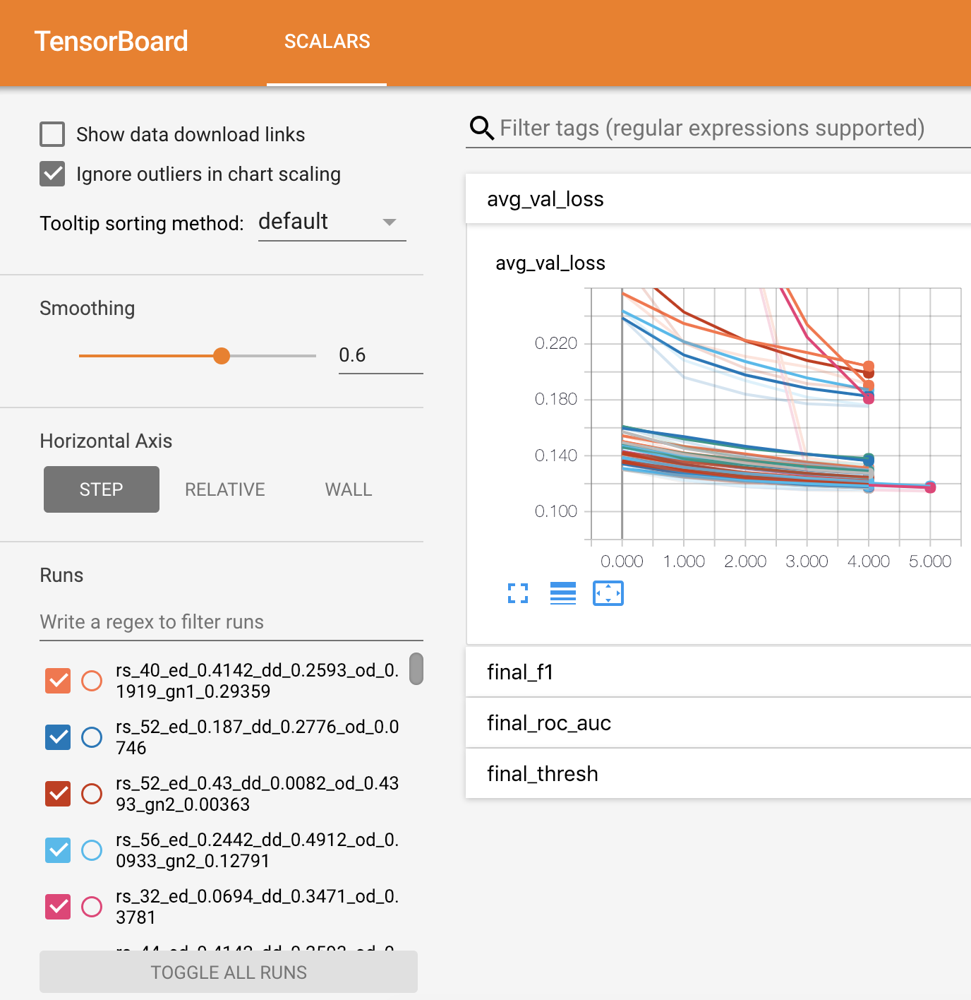

# Optimising a Recurrent Neural Network with hyperopt and tensorboardX

In this project I worked on tuning a recurrent neural networks hyper parameters using the popular optimisation package Hyperopt.

The data used was from the [Kaggle Quora Competition](https://www.kaggle.com/c/quora-insincere-questions-classification), a competition where the aim was to build a insincere question classifier. The inspiration to optimise a neural network for this task came from the competition constraints, the whole network must be able to train and predict within 2 hours on a kaggle docker image with GPU enabled. This meant that a highly optimised neural net architecture would be a sure way to perform well in this competition. Hyperopt is not the only optimisation framework I could have used, and I am eager to try out optuna and others in the near future.

To test the optimiser, first download the data off Kaggle into the input folder in this repository. Then run the python script preprocess.py, and main.py. 

NOTE: the download requires 6GB of space mostly due to the large embedding files, however to run this optimiser you will only need the glove embeddings and can avoid downloading the others. 

